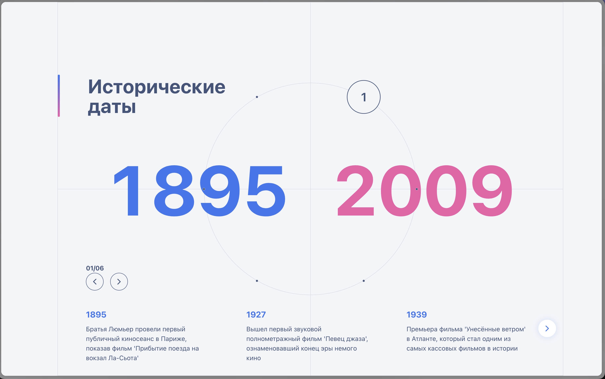
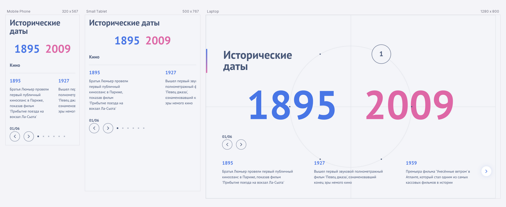
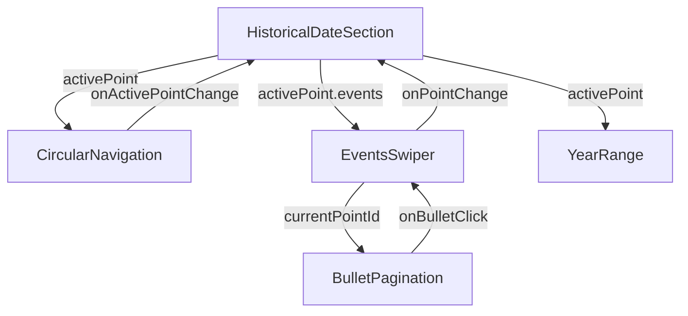

## Скриншоты




## Live Demo

https://only-gsap-test-frlihxwpp-vlims-projects.vercel.app/

## Быстрый старт

```
npm install

npm run start
```

## Стек технологий

- **Core**: `React 18 + TypeScript`
- **Styling**: `styled-components`
- **Animations**: `gsap` + `@gsap/react`
- **Slider**: `Swiper`
- **Bundler**: `Webpack 5 (dev-server, TS/Babel loaders).`

## Ключевые особенности

- ✅ GSAP-анимации с управлением очередью
- ✅ Полностью типизированный TypeScript
- ✅ Responsive дизайн с адаптивными брейкпоинтами
- ✅ Модульная архитектура компонентов
- ✅ Интеграция Swiper для слайдеров
- ✅ Централизованная система тем (styled-components)

## Архитектура

Проект построен по методологии Feature-Sliced Design (FSD) (частично адаптированной), разделяя логику на features, components, libs, hooks и app.
Главная точка входа: `src/index.tsx`, которая монтирует `src/app/App.tsx`.

### Диаграмма связанности компонентов



### Структура директорий

```

src/
├── app/                              # Конфигурация приложения
│   ├── App.tsx                       # Корневой компонент с провайдерами
│   ├── gsap/
│   │   └── gsap.ts                   # Настройка GSAP, регистрация плагинов
│   └── styles/
│       ├── theme.ts                  # Система дизайн-токенов
│       ├── global-styles.ts          # Глобальные CSS стили
│       └── styled.d.ts               # TypeScript типы для темы
│
├── features/                         # Бизнес-фичи
│   └── historical-date/
│       ├── historical-date-section.tsx    # Главная секция с круговой навигацией
│       ├── components/
│       │   ├── swiper/
│       │   │   └── events-swiper.tsx      # Слайдер событий с Swiper
│       │   └── year-range.tsx             # Отображение диапазона годов
│       └── constants/
│           └── historical-dates-mok.constants.ts  # Mock-данные исторических дат
│
├── components/                       # UI-компоненты
│   ├── animations/
│   │   └── reveal-container.tsx      # Wrapper для fade-in анимаций
│   ├── layout/
│   │   ├── flex.tsx                  # Flexbox-контейнер с props
│   │   └── quadrant-container.tsx    # Контейнер с разделением на квадранты
│   ├── typography/
│   │   └── header.tsx                # Типографские заголовки (h1-h6)
│   ├── ui/
│   │   ├── separator.tsx             # Разделительные линии
│   │   ├── button.tsx                # Кнопки
│   │   └── number-counter/
│   │       └── number-counter.tsx    # Анимированный счётчик чисел
│   ├── circular-navigation.tsx       # Круговая навигация (главный компонент)
│   └── bullet-pagination.tsx         # Точечная пагинация (используется в мобильной версии)
│
├── layouts/
│   └── main-layout.tsx               # Основной layout приложения
│
├── hooks/
│   └── use-media-query.ts            # Хук для медиа-запросов
│
├── libs/                             # Хелперы для переиспользуемого применения
│   └── gsap/
│       └── animations/
│           ├── apply-hover-style-tiem.ts  # Hover-эффекты для точек
│           └── reset-hover-style-item.ts  # Сброс hover-стилей
│
├── utils/
│   └── colors.ts                     # Утилиты работы с цветами
│
├── types/
│   └── declarations.d.ts             # Глобальные TypeScript декларации
│
└── index.tsx                         # Точка входа приложения
```

## Каталог основных компонентов

### 1. CircularNavigation

Назначение: Главный интерактивный компонент с круговым расположением точек категорий.

| Prop                | Type                           | Default      | Description                       |
| ------------------- | ------------------------------ | ------------ | --------------------------------- |
| points              | HistoricalDate                 | required     | Данные точек навигации            |
| radius              | number                         | 300          | Радиус окружности (px)            |
| pointSize           | number                         | 56           | Размер точки (px)                 |
| targetAngle         | number                         | -Math.PI / 3 | Целевой угол позиционирования     |
| activePointId       | number                         | required     | ID активной точки                 |
| initialDelay        | number                         | 1.5          | Задержка начальной анимации (сек) |
| onActivePointChange | (point: TimeLinePoint) => void | required     | Callback изменения активной точки |

**Алгоритм анимации**

```ts
// Система очередей для предотвращения гонки анимаций
const isAnimatingRef = useRef(false); // Флаг активной анимации
const animatingToPointIdRef = useRef(number); // Целевая точка текущей анимации
const pendingPointRef = useRef(null); // Очередь отложенных запросов

// Логика обработки очереди
if (isAnimatingRef.current) {
  if (pointId !== animatingToPointIdRef.current) {
    pendingPointRef.current = { point, previousId };
  }
  return; // Пропускаем, если уже анимируем к этой точке
}
```

**Особенности реализации**

1. Круговое позиционирование:

```ts
const angle = index * angleIncrement + angleOffset;
const x = centerX + radius * Math.cos(angle);
const y = centerY + radius * Math.sin(angle);
```

2. Поворот с компенсацией

```ts
// Поворот галереи
gsap.to(gallery, { rotation: newRotation });

// Компенсация поворота для меток
gsap.to(label, { rotation: -(newRotation + initialRotation) });
```

3. Интерактивные состояния:

- Hover-эффекты с масштабированием (scale: 1.5)
- Активное состояние с изменением фона
- Плавные переходы между точками (1.2s, power2.inOut)

Пример использования:

```tsx
<CircularNavigation
  activePointId={activePoint.id}
  points={historicalDates}
  radius={265}
  pointSize={56}
  initialDelay={1}
  onActivePointChange={(point) => setActivePoint(point)}
/>
```

---

### 2. BulletPagination

Назначение: Компонент точечной пагинации с анимированными переходами.

| Prop           | Type                    | Default  | Description                 |
| -------------- | ----------------------- | -------- | --------------------------- |
| totalPoints    | number                  | required | Общее количество точек      |
| currentPointId | number                  | required | ID текущей активной точки   |
| onBulletClick  | (index: number) => void | –        | Callback клика по точке     |
| initialDelay   | number                  | 0.5      | Задержка начальной анимации |

**Структура анимации**

```ts
// Начальная анимация (каскадное появление)
bullets.forEach((bullet, index) => {
  tl.to(
    dot,
    {
      scale: 1,
      opacity: 0.4,
      duration: 0.4,
      ease: 'back.out(1.7)',
    },
    index * 0.08,
  ); // Последовательное появление
});

// Анимация активной точки
tl.to(activeDot, {
  scale: 1.2,
  opacity: 1,
  ease: 'back.out(2)',
});
```

**Особенности**:

- Очередь анимаций: Управление через isAnimatingRef + pendingIndexRef
- Kill tweens: gsap.killTweensOf() перед новой анимацией
- Защита от двойного клика: Игнорирование клика на текущую точку

### 3. EventsSwiper

Карусель событий с кастомной навигацией и адаптивными настройками.

| Prop           | Type                 | Description                    |
| -------------- | -------------------- | ------------------------------ |
| events         | TimeLineEvent[]      | Массив событий для отображения |
| currentPointId | number               | ID текущей категории           |
| totalPoints    | number               | Общее количество категорий     |
| onPointChange  | (id: number) => void | Callback изменения категории   |
| isMobile       | boolean              | Флаг мобильного режима         |

**Пример использования:**

```tsx
import { EventsSwiper } from './components/swiper/events-swiper';

<EventsSwiper
  onPointChange={handlePointChange}
  events={activePoint.events}
  currentPointId={activePoint.id}
  totalPoints={6}
  isMobile={false}
/>;
```

**Конфигурация Swiper**

```ts
// Desktop конфигурация
{
  slidesPerView: 3,
  spaceBetween: 80,
  navigation: true,
  pagination: false
}

// Mobile конфигурация
{
  slidesPerView: 'auto',  // Динамическое определение
  spaceBetween: 25,
  navigation: false,
  pagination: { type: 'fraction' }
}
```
